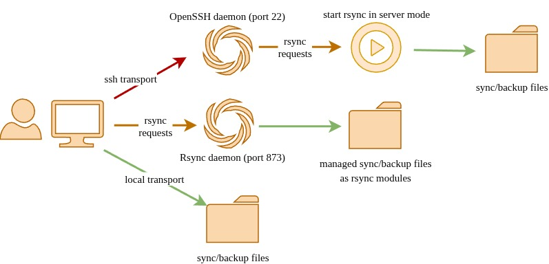

## What is cwRsync-client?

cwRsync-client is a bare-bones Windows packaging of the rsync command-line tool. It lets you efficiently backup or synchronize files between local and remote systems using the powerful rsync algorithm, transferring only changed data. The package includes the necessary binaries and SSH support for secure transfers.

Looking for a production-ready rsync server for Windows? See [cwRsync Server](https://www.itefix.net/cwrsync/server) from Itefix

## Usage

* Visit the repository’s [Releases](https://github.com/itefixnet/cwrsync-client/releases) page on GitHub and download the zip for the current version (e.g., cwrsync_6.4.6_x64_free.zip). 
* Unzip it into a directory of your choosing (e.g., C:\cwrsync).
* Use the provided **[cwrsync.cmd](https://github.com/itefixnet/cwrsync-client/blob/main/build/cwrsync.cmd)** for proper use or guidance

The archive contains rsync.exe, SSH related binaries, and supporting DLLs. The rsync binary provided has following convenient patches:

- transliterate
- timelimit
- ignore case
- [unofficial patch](https://github.com/itefixnet/cwrsync-client/blob/main/build/no-password-file-check.diff) to avoid permissions error for password file option

## Resources

- [FAQ](docs/FAQ.md) - Frequently Asked Questions
- [Changelog](https://github.com/itefixnet/changelogs/blob/main/changelogs/cwrsync-client.md)

## Related Products from Itefix.net

- [Rsync server solution for serving rsync requests from your computer](https://itefix.net/cwrsync/server)
- [Secure rsync server solution with SSH support](https://itefix.net/cwrsync-copssh-server-kit)
- [Graphical helper tool for managing and running rsync client tasks](https://itefix.net/rsync-client-helper-gui) 

## Links

- [Rsync](http://rsync.samba.org/)
- [Rsync algorithm](http://rsync.samba.org/tech_report/)
- [Cygwin](http://www.cygwin.com/)
- [transliterate patch](https://git.samba.org/?p=rsync-patches.git;a=blob;f=transliterate.diff;h=58b2fb26767c17ce32df08942e55159eca672676;hb=ad11a2bcb3aea2faa0c7523fbaaa42e303b0620b)
- [timelimit patch](https://git.samba.org/?p=rsync-patches.git;a=blob;f=time-limit.diff;h=15bf553a21dd8f2a545047ba692b8f811b369201;hb=ad11a2bcb3aea2faa0c7523fbaaa42e303b0620b)
- [ignore case patch](https://git.samba.org/?p=rsync-patches.git;a=blob;f=ignore-case.diff;h=3239ee66b3e415e2dd7ee812118cd1ca5ea6b0c1;hb=ad11a2bcb3aea2faa0c7523fbaaa42e303b0620b)
